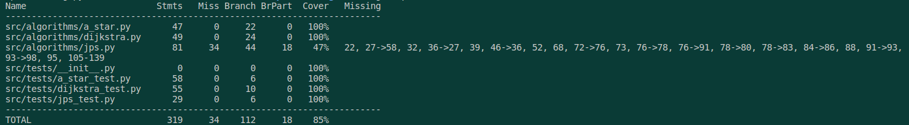

# Testaus dokumentti

## Testaus

### Yksikkötestaus

Yksikkötestauksessa testataan Dijkstra-luokkaa, AStar-luokkaa ja JPS-luokkaa. Nämä testit ovat toteutettu Pytest kirjastolla. Dijkstran lyhimmän polun algoritmia testataan pienellä 4x4 matriisilla missä on vain yksi reitti lähtöpisteestä maaliin.
```python
def setUp(self):
    self.maze = [
        [0, 0, 0, 0],
        [1, 1, 0, 1],
        [0, 0, 0, 0],
        [0, 1, 1, 0]
    ]
    self.dijkstra = Dijkstra(self.maze)
def test_dijkstra(self):
    start = (0, 0)
    end = (3, 3)
    expected_path = [(0, 0), (0, 1), (1, 2), (2, 2), (3, 3)]
    self.assertEqual(self.dijkstra.dijkstra(start, end), expected_path)
```

AStar algoritmia testataan samalla matriisilla missä on kaksi reittiä lähtöpisteestä maaliin. Testit on toteutettu siten, että ne tarkistavat että algoritmit löytävät lyhimmän reitin ja että reitin pituus on oikea. 
```python
def test_a_star(self):
    start = (0, 0)
    end = (3, 3)
    expected_path = [(0, 0), (0, 1), (1, 2), (2, 3), (3, 3)]
    self.assertEqual(self.a_star.a_star(start, end), expected_path)
```
Seuraavaksi Dijkstran algoritmia testataan osaako algoritmi valita seuraavan maalia lähimman solmun. Tämä testi on toteutettu siten, että algoritmi valitsee maalin lähimmän solmun, mutta ei pääse maaliin.
```python
def test_get_closest_node(self):
    self.dijkstra.distances = [
        [0, 1, 2, 3],
        [float('inf'), float('inf'), 3, float('inf')],
        [4, 3, 2, 1],
        [5, float('inf'), float('inf'), 2]
    ]
    self.dijkstra.visited = [
        [True, True, True, True],
        [False, False, True, False],
        [True, True, True, False],
        [True, False, False, False]
    ]
    expected_node = (2, 3)
    self.assertEqual(self.dijkstra.get_closest_node(), expected_node)
```
Seuraavaksi testataan A-star algoritmia siten, että sen lyhin reitti on saman pituinen kuin dijkstran lyhin reitti. 
```python
def test_a_star_len(self):
        start = (3, 0)
        end = (0, 0)
        self.assertEqual(len(self.a_star.a_star(start, end)), len(self.dijkstra.dijkstra(start, end)))
```
Seuraavaksi on testattu molempia luokkia samalla tavalla, että algoritimit antavat oikeat virhe ilmoitukset, kun lähtöpiste tai maali on seinä. Tai lähtöpiste tai maali on ulkona matriisista. Tai lähtöpiste ja maali ovat samat.
```python
def test_a_star_same_start_end(self):
    start = (0, 0)
    end = (0, 0)
    expected_path = [(0, 0)]
    self.assertEqual(self.a_star.a_star(start, end), expected_path)
def test_a_star_invalid_start_end(self):
    start = (-1, -1)
    end = (4, 4)
    with self.assertRaises(IndexError):
        self.a_star.a_star(start, end)
def test_a_star_wall(self):
    start = (1, 0)
    end = (1, 1)
    with self.assertRaises(IndexError):
        self.a_star.a_star(start, end)
```
Tämän jälkeen on testattu että algoritmit löytävät lyhimmän reitin, kun kyseessä on 50x50 matriisi.
```python
def test_a_star_large_maze(self):
    large_maze = [[0] * 50 for _ in range(50)]
    dijkstra = Dijkstra(large_maze)
    a_star = AStar(large_maze)
    start = (0, 0)
    end = (49, 49)
    self.assertEqual(a_star.a_star(start, end), dijkstra.dijkstra
    (start, end))
```
Seuraavaksi testataan että algoritmit löytävät lyhimmän reitin, kun kyseessä on matriisi jossa on vain yksi mahdollinen reitti lähtöpisteestä maaliin. Tässä testissä on myös testattu että algoritmi osaa kulkea joka suuntaan.
```python
def test_a_star_path(self):
    maze = [
        [0, 0, 0, 0, 0, 0, 0, 0, 0, 0],
        [1, 1, 1, 1, 1, 1, 0, 1, 1, 1],
        [0, 0, 0, 0, 0, 0, 0, 1, 1, 0],
        [0, 1, 1, 1, 1, 1, 1, 1, 1, 0],
        [0, 1, 0, 0, 0, 0, 0, 0, 0, 0],
        [0, 1, 0, 1, 1, 1, 1, 1, 1, 0],
        [0, 1, 0, 0, 0, 0, 0, 0, 1, 0],
        [0, 1, 1, 1, 1, 1, 1, 0, 1, 0],
        [0, 0, 0, 0, 0, 0, 0, 1, 0, 0],
        [0, 1, 1, 1, 1, 1, 1, 1, 1, 0]
    ]
    dijkstra = Dijkstra(maze)
    a_star = AStar(maze)
    start = (0, 0)
    end = (9, 9)
    self.assertEqual(dijkstra.dijkstra(start, end), a_star.a_star(start, end))
```
Ja viimeiseksi vielä testataan osaako algoritmi laskea oikein operaatioiden määrän.
```python
def test_operation_count(self):
        start = (0, 0)
        end = (3, 3)
        self.a_star.a_star(start, end)
        self.assertEqual(self.a_star.get_operations(), 5)
```
### JPS algoritmi

Jump point search -algoritmia on tällä hetkellä testattu osittain samoilla testeillä kuin A-star algoritmia. Tämä johtuu siitä, että JPS algoritmi on A-star algoritmin muokkaus.

## Testikattavuus



Kuten kuvasta näkee testikattavuus on 85%%, vain joitakin jps algoritmin kohtia ei ole testattu kokonaan. Tämä johtuu siitä, että jps algoritmin testaaminen on haastavaa ja vielä en ole löytänyt sopivaa tapaa testata sitä kattavasti.

## Testaus ohjeet

Projekti toimii Python versiolla ^3.8. Poetryn riippuvuuksien asentamisen jälkeen 
```bash
poetry install
```
testit voi ajaa komennolla:
```bash
poetry shell
pytest ./src
```
Tai komennolla:
```bash
poetry shell
coverage run --branch -m pytest ./src
```

