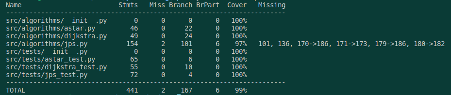

# Testaus dokumentti

## Testaus

### Dijkstran algoritmi

Dijkstran lyhimmän polun algoritmia on testattu yksikkötesteillä mitkä kattavat kaikki kahdeksan suuntaa. Myös kaikki oikeellisuus tarkistukset on tehty sekä testattu, että algoritmi toimii oikein myös silloin kun maali on esteen päällä. Algoritmia on testattu myös kartalla missä on vain yksi mahdollinen reitti.

### A* algoritmi

A* algoritmi on testattu samalla tavalla kuin Dijkstran algoritmi. A* algoritmin testit kattavat myös kaikki kahdeksan suuntaa. Myös kaikki oikeellisuus tarkistukset on tehty sekä testattu, että algoritmi toimii oikein myös silloin kun maali on esteen päällä. Algoritmia on testattu myös kartalla missä on vain yksi mahdollinen reitti. A* algoritmia on myös testattu 

### JPS algoritmi

Jump point search -algoritmia on tällä hetkellä testattu osittain samoilla testeillä kuin A* algoritmia. Tämä johtuu siitä, että JPS algoritmi on A* algoritmin muokkaus.

## Testikattavuus



Kuten kuvasta näkee testikattavuus on 99%%, vain joitakin JPS algoritmin kohtia ei ole testattu kokonaan. 

## Suorityskykytestaus

map5: 

Suorituskyky testaus on toteutettu kartalla 'map5', koska tämä kartta on monipuolisin. Testaus on toteutettu siten, että jokainen algoritmi on ajettu 10 kertaa viidessä eri mielivaltaisesti valitussa lähtö- ja maalipisteessä. Tämän jälkeen on laskettu keskiarvo jokaiselle algoritmille ajan ja operaatioiden määrän suhteen.


Kuvasta näemme, että JPS algoritmi on selkeästi nopein. Tämä johtuu siitä, että JPS algoritmi hyödyntää A* algoritmia ja tekee siitä tehokkaamman, koska JPS skannaa etukäteen mihin suuntaan olisi tehokkainta edetä. Dijkstran algoritmi on hitain. Kuitenkin merkittävintä on se, että Dijkstran algoritmi on melkein puolet hitaampi kuin A* ja yli puolet hitaampi, kuin JPS.


JPS operaatioita on selvästi vähiten. Dijkstran algoritmi suorittaa operaatioita yli kaksi kertaa enemmän kuin A* ja monin kertaisesti enemmän kuin JPS.

### Johtopäätökset

Vaikka JPS algoritmi suorittaa merkkittävästi vähemmän operaatioita, kuin A* ja Dijkstra niin ei sen aikaero ei ole yhtä suurin kuin operaatioiden määrän ero. Tämä johtuu siitä, että ainakaan tässä JPS toteutuksessa JPS:n etukäteen skannaaminen ei ole kovin tehokasta, joten myös joissakin skenaarioissa JPS voi olla hitaampi kuin A*.

Dijkstran ja A* erot ovat selkeät näissä testatuissa skenaarioissa. Kuiten A* algoritmin heurestiikkaa on mahdollista 'vedättää', jotta A* algoritmi suorittaa enemmän operaatioita kuin Dijkstra ja käyttää enemmän aikaa kuin Dijkstra. Näissä testeissä ei ole kuitenkaan yritetty vedättää A* algoritmia.
Tämmönen 'vedätys' onnistuu skenaariossa, jossa lähtöpisteestä maalipisteeseen on reitti, mutta reitti on esteen takana. Tällöin A* algoritmi skannaa esteen ympärillä olevia ruutuja, mutta Dijkstra ei skannaa esteen ympärillä olevia ruutuja. Tämä johtuu siitä, että Dijkstra algoritmi ei käytä heurestiikkaa, joten se ei voi tietää, että esteen takana on maalipiste. Tämä on kuitenkin ongelma vain tietyissä skenaarioissa, joten A* algoritmi on yleisesti ottaen parempi kuin Dijkstra.

## Testaus ohjeet

Projekti toimii Python versiolla ^3.8. Voit testata ohjelmaa asentammalla ensin Poetryn riippuvuudet komennolla:
```bash
poetry install
```
Tämän jälkeen testit voi ajaa komennolla:
```bash
poetry run invoke test
```
tai komennolla:
```bash
poetry run invoke coverage
```
Testikattavuusraportin voi generoida komennolla:
```bash
poetry run invoke report
```
tai komennolla:
```bash
poetry run invoke html
```
Tämän jälkeen voi tarkastella testikattavuutta avaamalla tiedoston htmlcov/index.html selaimella:

```bash
firefox htmlcov/index.html
```

