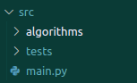

# Toteutusdokumentti

## Ohjelman yleisrakenne

- Algorithms kansio sisältää algoritmien toteutukset (Dijkstra, A*, JPS). 
- Tests kansio sisältää algoritmien yksikkötestit.
- main.py sisältää käyttöliittymän. 

## Algoritmien toteutus

Algoritmit on toteutettu käyttäen Pythonin listoja ja sanakirjoja. Algoritmit käyttävät apunaan Pythonin heapq kirjastoa, joka on toteutettu binäärikekona. Lisäksi JPS-luokassa on käytetty NumPy-kirjastoa, joka on toteutettu C-kielellä ja on nopeampi kuin Pythonin listat ja sanakirjat.

### Dijkstran lyhimmänpolun algoritmi:
- algoritmin aikavaativuus on O(n + m log n), missä n on solmujen määärä ja m on kaarien määrä. [1]

### A*-algoritmi:
- huonoimmassa tapauksessa A* tekee yhtä monta operaatiota kuin Dijkstran algoritmi, mutta keskimäärin A* tekee paljon vähemmän operaatioita. Tämä perustuu siihen että A* käyttää heuristiikkaa, joka ohjaa algoritmia kohti maalia. Keosta poistetaan aina pienin arvo, joka on heuristiikan ja etäisyyden summa. Tämä tarkoittaa sitä, että algoritmi käy ensin läpi solmut, jotka ovat lähellä maalia. Tässä toteutuksessa heurestiikka on eukliidinen. [2]

### Jump Point Search -algoritmi (JPS):
- JPS-algoritmin on toteutettu perustuen artikkeliin [3]. JPS käyttää tässä toteutuksessa samaa heurestiikkaa kuin A* algoritmi. JPS-algoritmi on nopeampi kuin A* algoritmi, koska se hyppää yli solmuja, mitkä eivät ole osa polkua. JPS-algoritmi ei hae aina lyhintä polkua vaan optimaalisen reitin. [3]

## Käyttöliittymä

Käyttöliittymää on komentoriviltä ajettava yksinkertainen toteutus. Voit valita 9 eri kartasta missä haluat etsiä lyhimmän polun. Voit valita kartan kirjoittamalla sen nimen. Tulos näytetään kartalla, missä vihreä on este, punainen on A* algoritmin löytämä polku ja sininen on JPS algoritmin löytämä polku. A* algoritmin löytämä polku on myös lyhin polku.

## Lähteet

[1] Dijkstra (3.3.2023). [Wikipedia](https://en.wikipedia.org/wiki/Dijkstra%27s_algorithm), luettu 19.3.2023. 

[2] A-star (27.2.2023). [Wikipedia](https://en.wikipedia.org/wiki/A*_search_algorithm), luettu 19.3.2023.

[3] D. Harabor & A. Grastien (2012). [JPS](http://users.cecs.anu.edu.au/~dharabor/data/papers/harabor-grastien-aaai11.pdf), luettu 20.4.2023.